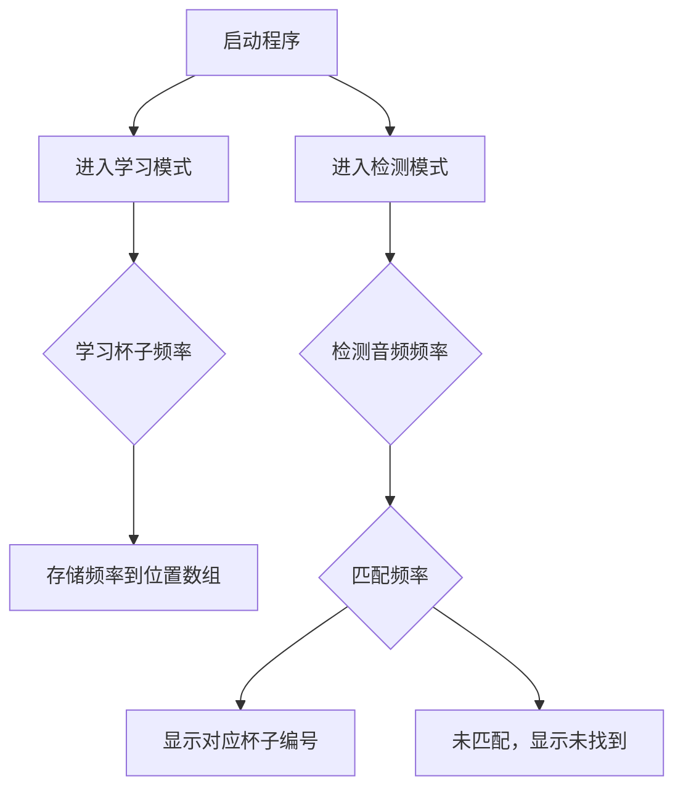

# 🎯 2023全国电子设计大赛一等奖作品 - 音频杯感应系统

## 📚 项目简介
本项目是一个基于音频信号处理的智能识别系统，荣获2023年全国电子设计大赛一等奖。系统通过实时音频分析，识别不同杯子的敲击频率，并在界面上显示对应的杯子编号。完成了赛题需求，完善了应用功能，将音频分析和软件实现进行了优化。

---

## 🛠 环境要求
- **Python 3.6+**
- **PyQt5**
- **PyAudio**
- **NumPy**

---

## 🚀 快速开始

### 1. 安装依赖
```bash
pip install PyQt5 PyAudio numpy
```

### 2. 运行程序
```bash
python main.py
```

### 3. 使用说明
- **启动程序**：点击“启动”按钮，开始音频分析。
- **学习杯子频率**：点击相应的“X号杯子”按钮，系统将学习该杯子的敲击频率。
- **检测杯子**：点击“检测”按钮，系统将识别当前敲击的杯子，并在界面上显示对应的杯子编号。

---

## 📈 功能介绍

### 1. **音频分析模块**
- **频率检测**：实时采集音频信号，通过FFT变换获取频率信息。
- **频率模式识别**：统计一段时间内的频率出现次数，识别最常见频率作为杯子的特征频率。

### 2. **界面控制模块**
- **控制按钮**：启动、检测、测试频率。
- **结果显示**：显示检测到的杯子编号。
- **学习按钮**：学习不同杯子的频率。

---

## 📊 流程图


---

## 📧 联系方式
- **邮箱**：1367713858@qq.com
- **GitHub**：[https://github.com/BZPJ2000](https://github.com/BZPJ2000)

---

如有任何疑问，欢迎联系，或在GitHub上提出想法和建议。
