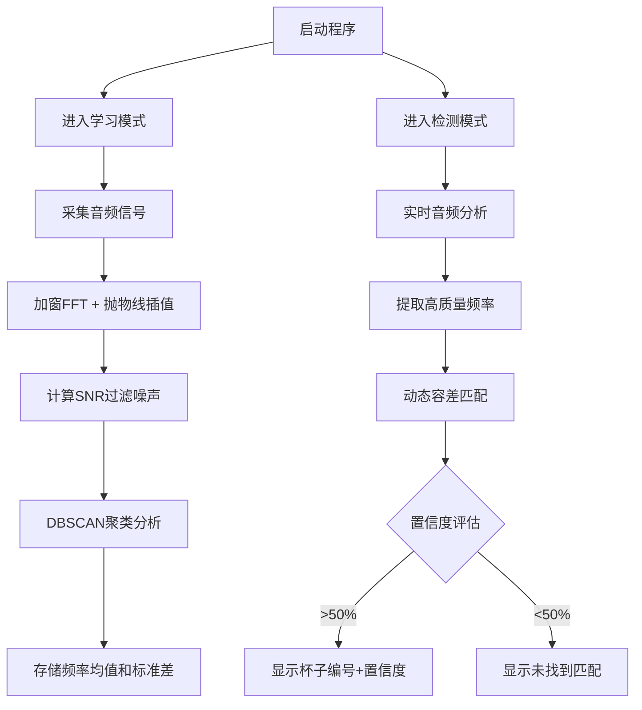

# 🎯 2023全国电子设计大赛一等奖作品 - 音频杯感应系统

## 📚 项目简介
本项目是一个基于音频信号处理的智能识别系统，荣获2023年全国电子设计大赛一等奖。系统通过实时音频分析，识别不同杯子的敲击频率，并在界面上显示对应的杯子编号。完成了赛题需求，完善了应用功能，将音频分析和软件实现进行了优化。

---

## 🛠 环境要求
- **Python 3.6+**
- **PyQt5** - GUI框架
- **PyAudio** - 音频采集
- **NumPy** - 数值计算
- **SciPy** - 科学计算（信号处理）
- **scikit-learn** - 机器学习（DBSCAN聚类）

---

## 🚀 快速开始

### 1. 安装依赖
```bash
pip install PyQt5 PyAudio numpy scipy scikit-learn
```

### 2. 运行程序
```bash
python main.py
```

### 3. 使用说明
- **启动程序**：点击"启动"按钮，开始音频分析。
- **学习杯子频率**：点击相应的"X号杯子"按钮，系统将学习该杯子的敲击频率（建议多敲击几次以获得更好的学习效果）。
- **检测杯子**：点击"检测"按钮，系统将识别当前敲击的杯子，并在界面上显示对应的杯子编号和置信度。
- **查看置信度**：界面会显示识别的置信度百分比和频率差，帮助判断识别的可靠性。

---

## 📈 功能介绍

### 1. **音频分析模块（已优化）**
- **改进的频率提取**：
  - 使用汉明窗减少频谱泄漏
  - 抛物线插值提高频率分辨率
  - 提取谐波信息增强特征

- **信号质量评估**：
  - 实时计算信噪比（SNR）
  - 自动过滤低质量信号（SNR < 5dB）
  - 确保只处理高质量的音频数据

- **DBSCAN聚类算法**：
  - 自动识别频率簇，过滤离群点
  - 提供统计信息（均值、标准差、簇大小）
  - 比简单众数统计更鲁棒

### 2. **智能匹配模块**
- **动态容差匹配**：
  - 根据学习时的频率稳定性自动调整容差
  - 适应不同杯子的特性差异

- **置信度评分系统**：
  - 综合频率匹配度（70%权重）和稳定性（30%权重）
  - 实时显示识别置信度和频率差
  - 低于50%置信度的匹配会被标记为不可靠

### 3. **界面控制模块**
- **控制按钮**：启动、检测、测试频率
- **结果显示**：显示检测到的杯子编号、置信度、频率差
- **学习按钮**：学习不同杯子的频率，显示学习质量

---

## 📊 流程图


---

## 🎯 算法优势

### 准确率提升
1. **抗噪声能力更强**
   - 汉明窗减少频谱泄漏
   - SNR过滤低质量信号
   - DBSCAN自动过滤离群点

2. **频率分辨率更高**
   - 抛物线插值提高精度
   - 可以区分更接近的频率

3. **智能匹配**
   - 动态容差适应不同杯子的稳定性
   - 置信度评分提供可靠性指标

4. **鲁棒性更好**
   - 聚类算法对异常值不敏感
   - 多次测量的统计分析

---

## 📁 项目结构
```
AudioCupSense/
├── main.py                 # 程序入口
├── main_window.py          # GUI主窗口和控制逻辑
├── audio_worker.py         # 音频处理工作线程
├── audio_processor.py      # 优化的音频信号处理模块（新增）
├── utils.py                # 工具函数（包含匹配算法）
└── README.md               # 项目文档
```

---

## 💡 使用建议

### 学习阶段
- 在安静的环境中进行学习，减少背景噪声干扰
- 每个杯子建议敲击3-5次，让系统收集足够的样本
- 观察学习完成后显示的频率和稳定性数值
- 稳定性数值越小，说明该杯子的频率特征越稳定

### 检测阶段
- 关注置信度显示，建议只信任置信度>60%的结果
- 如果置信度较低，可以重新学习该杯子
- 尽量保持与学习时相同的敲击力度和位置

### 环境要求
- 推荐在安静环境中使用（信噪比>10dB）
- 确保麦克风正常工作且灵敏度适中
- 避免多个声源同时存在

---

## 🔬 技术细节

### 核心算法
1. **加窗FFT**：使用汉明窗函数减少频谱泄漏
2. **抛物线插值**：三点插值法提高频率分辨率
3. **DBSCAN聚类**：eps=30Hz，min_samples=3
4. **信噪比计算**：信号频段2500-6000Hz，噪声频段<2500Hz
5. **动态容差**：base_tolerance + 2×std

### 参数配置
- 采样率：12000 Hz
- 缓冲区大小：4096 字节
- 频率检测阈值：>2500 Hz
- 最小信噪比：5 dB
- 样本收集数量：25个
- 置信度阈值：50%

---

## 📧 联系方式
- **邮箱**：1367713858@qq.com
- **GitHub**：[https://github.com/BZPJ2000](https://github.com/BZPJ2000)

---

如有任何疑问，欢迎联系，或在GitHub上提出想法和建议。
